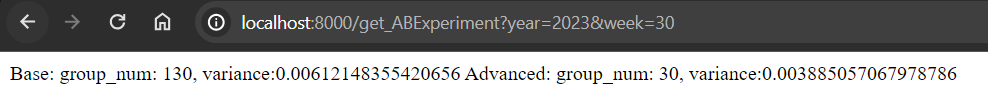

Dostępne endpointy:

GET:

/get_playlists?year=x&week=y

Zwraca słownik w postacie id_utworu: przydzielona grupa czyli nasza docelowa playlista.

/get_ABExperiment?year=x&week=y

Zwraca informację na temat ile grup utworzono oraz średnią wariancja w grupach dla modelu bazowego oraz model zawansowanego.

POST:

/new_sessions

przykładowe wywołanie: curl -X POST -H "Content-Type:application/json" -d '{json data as list of dict}' http://localhost:8000/new_sessions

Dodaje nowe sesje użytkowników najlepiej co tydzień dodawać dane z ostatniego tygodnia, a następnie zwraca predykcje na następny tydzień.

/new_artists

przykładowe wywołanie: curl -X POST -H "Content-Type:application/json" -d '{json data as list of dict}' http://localhost:8000/new_artists

Dodaje nowych artystów do istniejących.

/new_tracks

przykładowe wywołanie: curl -X POST -H "Content-Type:application/json" -d '{json data as list of dict}' http://localhost:8000/new_tracks

Analogicznie jak dla artystów dodaje nnowe utwory do istniejących.

Serwowanie predykcji:

Eksperyment A/B:

